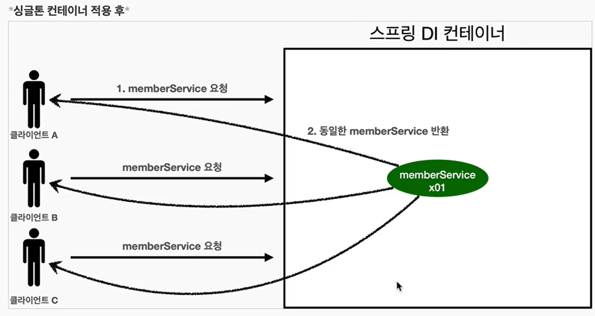

# 스프링 싱글톤 컨테이너
스프링 컨테이너는 싱글톤 패턴의 문제점을 해결하면서, 객체 인스턴스를 싱글톤(1개만생성)으로 관리한다.<br>
지금까지 우리가 학습한 스프링 Bean이 바로 싱글톤으로 관리되는 빈이다. 


<Strong>"싱글톤 컨테이너"</Strong>
- 스프링 컨테이너는 싱글톤 패턴을 적용하지 않아도, 객체 인스턴스를 싱글톤으로 관리한다. 이전에 설명한 컨테이너 생성 과정을 자세히 보면, 컨테이너는 객체를 하나만 생성해서 관리한다. 
- 스프링 컨테이너는 싱글톤 컨테이너 역할을 한다. 이렇게 싱글톤 객체를 생성하고 관리하는 기능을 <Strong>싱글톤 레지스트리라 한다.</Strong>
- 스프링 컨테이너의 이런 기능 덕분에 싱글턴 패턴의 모든 단점을 해결하면서 객체를 싱글톤으로 유지할 수 있다.
- 즉 싱글톤 패턴을 위한 지저분한 코드가 들어가지 않아도 된다. 
- DIP,OCP,테스트, private 생성자로부터 자유롭게 싱글톤을 사용할 수 있다
<br>
<br>
예제코드로 살펴보자.
```java
public class SingletonTest {
    
    
    @Test
    @DisplayName("스프링 컨테이너와 싱글톤")
    void springContainer() {
        /**
         * AnnotationConfigApplicationContext를 통해서 AppConfig를 넘겨주고 
         * 등록된 Bean을 getBean()메소드를 사용해서 가져온다. 
         */
        ApplicationContext ac = new AnnotationConfigApplicationContext(AppConfig.class);
        // 1 조회 : 호출 할 때 마다 객체를 생성
        MemberService memberService1 = ac.getBean("memberService", MemberService.class);
        MemberService memberService2 = ac.getBean("memberService", MemberService.class);

        //참조값이 다른 것을 확인
        System.out.println("memberService 1 : " + memberService1);
        System.out.println("memberService 2 : " + memberService2);

        assertThat(memberService1).isSameAs(memberService2);
    }
}
```
<br>
<br>
<Strong>싱글톤 컨테이너 적용 후</Strong>



- 스프링 컨테이너 덕분에 고객의 요청이 올 때 마다 객체를 생성하는 것이 아니라, 이미 만들어진 객체를 공유해서 효율적으로 재사용 할 수 있다.
- 스프링의 기본 빈 등록 방식은 싱글톤 이지만, 싱글톤 방식만 지원하는 것을 아니다. 요청할 때마다, 새로운 객체를 생성해서 반환하는 기능도 제공한다. 자세한 내용은 뒤 빈 스코프에서 설명한다. 
- 그리고 스프링은 싱글톤 방식으로 99% 동작한다.
<br>

