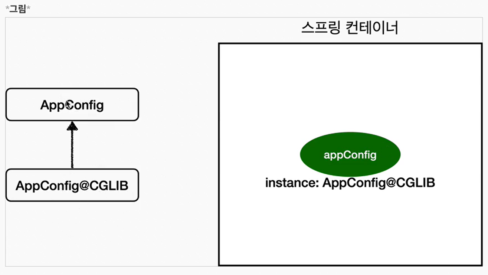
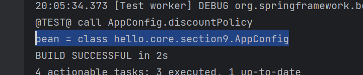
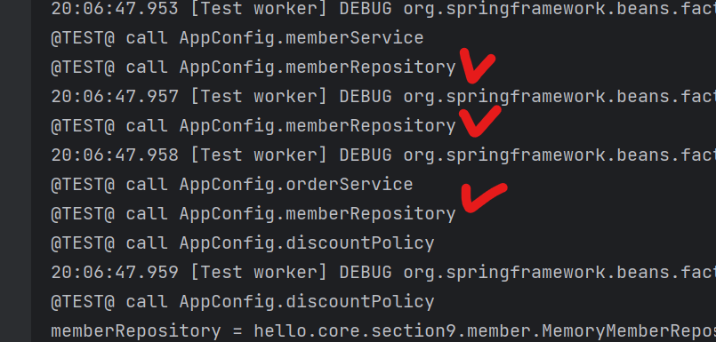
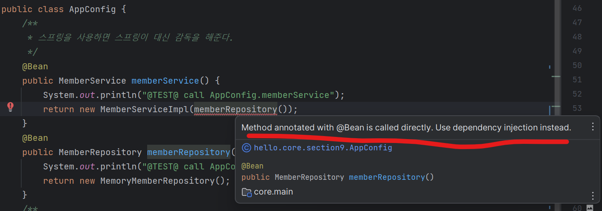

# @Configuration과 바이트코드 조작의 마법

```java
public class ConfigurationSingletonTest {

    @Test
    void configurationDeep(){
        ApplicationContext ac = new AnnotationConfigApplicationContext(AppConfig.class);
        AppConfig bean = ac.getBean(AppConfig.class);

        System.out.println("bean = " + bean.getClass());
    }
}
```

위의 결과를 보면 아래의 그림처럼 나오는데 AppConfig 뒤에 Enchance~ 로 시작하는 요상한 코드가 있다
<br>

.png)
<br>

이것은 내가 만든 클래스가 아니라 스프링의 CGLIB이라는 조작 라이브러리를 사용해서 AppConfig 클래스를 상속받은 임의의 다른 클래스를 만들고
그 다른 클래스를 스프링 빈으로 등록한 것



<br>

그 임의의 다른 클래스가 바로 싱글톤이 보장되도록 해준다. 아마도 다음과 같이 바이트 코드를 조작해서 작성이 되어 있을 것이다.
(실제로 CGLIB의 내부 기술을 사용하는데 매우 복잡함.)

<Strong>AppConfig$$EnhancerBySpringCGLIB$$f2a9d0a0</Strong>
    
```java
class Bean {
    @Bean
    public MemberRepository memberRepository() {
        if (memberRepository 가 이미 스프링 컨테이너에 등록되어 있으면){
            return memberRepository;
        }else{ // 스프링 컨테이너에 없으면 
            //기존 로직을 호출해서 MemoryMemberRepository를 생성하고 스프링 컨테이너에 등록
            return new MemoryMemberRepository();
        }
    }
}
```

<br>

- @Bean이 붙은 메서드마다 이미 스프링 빈이 존재하면 존재하는 빈을 반환하고, 
스프링 빈이 없으면 생성해서 스프링 빈으로 등록하고 반환하는 코드가 동적으로 만들어진다. 
- 덕분에 싱글톤이 보장되는 것

## @Configuration를 적용하지 않고 @Bean만 사용해도 싱글톤이 보장되는가?

#### AppConfig에서 @Configuration을 제거하고 테스트 해보자


- 순수한 AppConfig가 호출이 되었다.
- 


- memberRepository가 3번 호출되었고 서로 참조하는 메모리주소가 다르다.


- @Bean으로 등록된 메소드가 직접적으로 호출이 된다고 빨간줄이 뜬다. 


#### 정리
- @Bean만 사용해도 빈으로 등록이 되지만, 싱글톤을 보장하지 않는다.
- memberRepository() 처럼 의존관계 주입이 필요해서 메서드를 직접 호출할 때 싱글톤을 보장하지 않는다. 
- 크게 고민할 것이 없다. 스프링 설정 정보는 항상 @Configuration을 사용하자.

