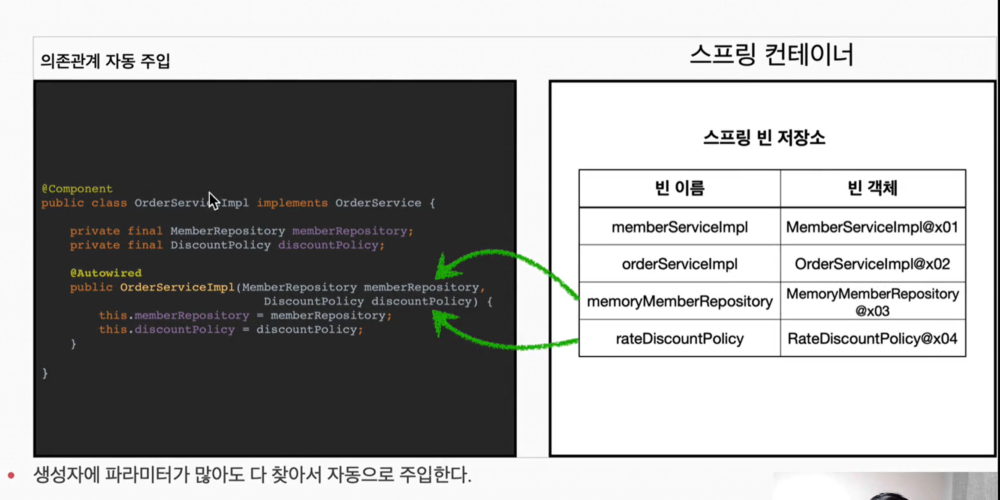

# 컴포넌트 스캔


## 컴포넌트 스캔과 의존관계 자동 주입 시작하기
- 지금까지 스프링 빈을 등록할 때는 자바 코드의 @Bean이나 XML <bean> 등을 통해서 설정 정보에 직접 등록할 스프링 빈을 나열했다.
- 예제에서 몇개가 안되었지만, 이렇게 등록해야 할 스프링 빈이 수십, 수백개가 되면 일일히 등록하기 힘들어지고 설정정보도 커지고, 누락되는 문제도 발생한다.
- 그래서 스프링은 설정 정보가 없어도 자동으로 스프링 빈을 등록하는 컴포넌트 스캔이라는 기능을 제공한다.
- 또 의존관계도 자동으로 주입하는 @Autowired라는 기능도 제공한다.


코드로 컴포넌트 스캔과 의존관계 자동 주입을 알아보자. 

```java
@Configuration
@ComponentScan(
        excludeFilters = @ComponentScan.Filter(type = FilterType.ANNOTATION, classes = Configuration.class)
        /**
         * @Configuration 붙은 객체는 Scan 제외
         * @Configuration 객체를 살펴보면 @Componet가 붙어있다.
        */
)
public class AutoAppConfig {

}
```

- 컴포넌트 스캔을 사용하려면 먼저 @ComponentScan 을 설정 정보에 붙여주면 된다.
- 기존의 AppConfig와는 다르게 @Bean으로 등록한 클래스가 하나도 없다.

```
참고!
컴포넌트 스캔을 사용하면 @Configration이 붙은 설정 정보도 자동으로 등록되기 때문에, AppConfig,TestConfig 등
앞서 만들어두었던 설정 정보도 함께 등록되고, 실행되어 버린다. 그래서 excludeFilters를 이용해서 설정 정보는 컴포넌트 스캔 대상에서 제외했다.
보통 설정 정보를 컴포넌트 스캔 대상에서 제외하지는 않지만, 기존 예제 코드를 최대한 남기고 유지하기 위해서 이 방을 선택했다.
```

컴포넌트 스캔은 이름 그대로 @Component 애노테이션이 붙은 클래스를 스캔해서 스프링 빈으로 등록했다.
@Component를 붙여주자.

```
참고!
@Configuration 도 @Component 애노테이션이 붙어있기 때문에 컴포넌트 스캔 대상이 된다.
```


### 예제 준비

- MemoryMemberRepository,MemberServiceImpl,RateDiscountPolicy에 컴포넌트 애노테이션을 사용해보자

```java
@Component
public class MemberServiceImpl implements MemberService{

    @Autowired // @Component를 쓰면 autowired를 쓰게 된다. ac.getBean(MemberRepository.class)와 같다.
    private final MemberRepository memberRepository;
    public MemberServiceImpl(MemberRepository memberRepository) {
        this.memberRepository = memberRepository;
    }
}
```
- 이전에 AppConfig에서는 @Bean으로 직접 설정 정보를 작성했고, 의존관계도 직접 명시했다. 
이제는 이런 설정 정보 자체가 없기 때문에 의존 관계 주입도 이 클래스 안에서 해결해야 한다.
- @Autowired 는 의존관계를 자동으로 주입해준다. 자세한 룰은 조금 뒤에 설명한다. 


```java

@Component
public class OrderServiceImpl implements OrderService {

    /**
     * OrderServiceImpl의 입장에서 생성자를 통해 들어올 구현체가 어떤 구현체인지는 알 수 없다.
     * 다만 AppConfig에서 결정할 뿐이다.
     *
     * 때문에 OrderServiceImpl는 의존관계에 대한 고민은 외부에 맡기고 오직 로직 실행에만 집중 하면 된다.
     */
    private final MemberRepository memberRepository;
    private final DiscountPolicy discountPolicy;

    @Autowired
    public OrderServiceImpl(MemberRepository memberRepository, DiscountPolicy discountPolicy) {
        this.memberRepository = memberRepository;
        this.discountPolicy = discountPolicy;
    }
}
```

- OrderServiceImpl도 마찬가지로 @Autowired를 사용해서 모든 의존관계를 자동적으로 주입한다.


## TestCode

```java
public class AutoAppConfigTest {
    @Test
    void basicScan(){
        AnnotationConfigApplicationContext ac = new AnnotationConfigApplicationContext(AutoAppConfig.class);

        MemberService memberService = ac.getBean(MemberService.class);
        Assertions.assertThat(memberService).isInstanceOf(MemberService.class);

    }
}
```
<br>
<br>
<br>

#### 1.ComponetScan


- @ComponentScan은 @Component 가 붙은 모든 클래스를 스프링 빈으로 등록한다.
- 이때 스프링 빈의 기본 이름은 클래스명을 사용하되 멘 앞글자만 소문자를 사용한다.
- "빈 이름 기본 전략" -> MemberServiceImpl 클래스 -> memberServiceImpl
- "빈 이름 직접 지정" -> 만약 스프링 빈의 이름을 직접 지정하고 싶으면 @Component("memberService2") 처럼 지정하면 된다.


#### 2. @Autowired의존관계 자동 주입


- 생성자에 @Autowired를 지정하면, 스프링 컨테이너가 자동으로 해당 스프링 빈을 찾앙서 주입한다.
- 이때 기본 조회 전략은 타입이 같은 빈을 찾아서 주입한다.
  - 'getBean(MemberRepository.class)'와 동일하다고 이해하면 된다.
  - 더 자세한 내용은 뒤에서 설명한다.


- 생성자에 파라미터가 많아도 다 찾아서 자동으로 주입한다.


## 정리

```java
@Configuration
@ComponentScan(
        excludeFilters = @ComponentScan.Filter(type = FilterType.ANNOTATION, classes = Configuration.class)
        /**
         * @Configuration 붙은 객체는 Scan 제외
         * @Configuration 객체를 살펴보면 @Componet가 붙어있다.
        */
)
public class AutoAppConfig {
    // @Bean으로 등록한 메소드는 없지만 @ComponentScan으  @Component가 붙은 객체들을 클래스패스를 다 뒤져서 스프링 빈에 다 등록해준다. 
}
```
- 즉 AppConfig를 따로 만들어서 일일히 모두 @Bean으로 등록할 필요가 없다. 싱글톤을 유지하고 싶은 객체는 @Component 어노테이션을 사용해주면 된다.
