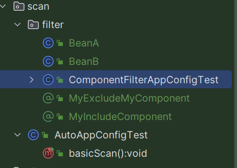

# 필터

바로 예제코드를 보자
패키지와 클래스는 다음과 같이 구성되어 있다.



### MyIncludeComponent

```java
@Target(ElementType.TYPE)
@Retention(RetentionPolicy.RUNTIME)
@Documented
public @interface MyIncludeComponent {
}
```
### MyExcludeComponent
```java
@Target(ElementType.TYPE)
@Retention(RetentionPolicy.RUNTIME)
@Documented
public @interface MyExcludeComponent {
}
```

### BeanA

```java
@MyIncludeComponent
public class BeanA {
}
```

### BeanB

```java
@MyExcludeComponent
public class BeanB {
}
```


### ComponentFilterAppConfigTest

```java
public class ComponentFilterAppConfigTest {

    @Test
    void filterScan(){
        ApplicationContext ac = new AnnotationConfigApplicationContext(ComponentFilterAppConfig.class);
        BeanA beanA = ac.getBean("beanA", BeanA.class);
        assertThat(beanA).isNotNull();

        ac.getBean("beanB", BeanB.class);
        //org.springframework.beans.factory.NoSuchBeanDefinitionException: No bean named 'beanB' available
        //BeanB에 설정된 어노테이션 MyExcludeComponent 때문에 스프링 빈으로 등록되지 않는다.

        org.junit.jupiter.api.Assertions.assertThrows(NoSuchBeanDefinitionException.class,
                () -> ac.getBean("beanB", BeanB.class));
    }

    @Configuration
    @ComponentScan(
            includeFilters = @Filter(type = FilterType.ANNOTATION, classes = MyIncludeComponent.class), // 필터 포함 대상
            excludeFilters = @Filter(type = FilterType.ANNOTATION, classes = MyExcludeMyComponent.class)) // 필터 제외대상
    static class ComponentFilterAppConfig{

    }
}
```

- 위의 예제에서 볼 수 있듯 ComponentFilterAppConfig 클래스의 @ComponentScan 어노테이션 설정에 의해서 BeanB만 컴포넌트 스캔 대상에서 제외되었다.


### FilterType 옵션
#### FilterType에는 5가지 옵션이 있다.
- ANNOTATION : 기본값, 애노테이션을 인식해서 동작
  - ex) org.example.SomeAnnotation
- ASSIGNABLE_TYPE : 지정한 타입과 자식 타입을 인식해서 동작
  - ex) org.example.SomeClass
- ASPECTJ : AspectJ 패턴 사용
  - ex) org.example..*Service+  // org.example 패키지와 하위 패키지에 있는 모든 클래스 중 이름이 Service로 끝나는 클래스
- REGEX : 정규 표현식
  - ex) org\.example\.Default.*
- CUSTOM : TypeFilter 이라는 인터페이스를 구현해서 처리
  - ex) org.example.MyTypeFilter


