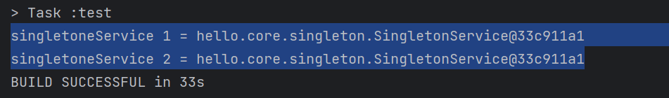

# 싱글톤 패턴 적용 Section 9

## 싱글톤 패턴이란?
 - 클래스의 인스턴스가 딱 1개만 생성되는 것을 보장하는 디자인 패턴임.
 - 그래서 객체 인스턴스를 2개 이상 생성하지 못하도록 막아야 한다. 

```
    SingletonService.java
    
    1. static 영역에 객체 인스턴스를 딱 1개만 생성해둔다.
    private static final SingletonService instance = new SingletonService();
    
    2. public으로 열어서 객체 인스턴스가 필요하면 이 static 메서드(getInstance())를 통해서만 조회하도록 허용한다. 
    public static SingletonService getInstance(){
        return instance;
    }
    
    ## 제일 중요
    3.단 1개의 객체 인스턴스만 존재해야 하므로 생성자를 private 으로 선언해서 외부에서 new 키워드를 사용한 객체 생성을 못하게 막는다. 
    private SingletonService(){}
```

한줄로 정리하자면 다음과 같다.<br>
클래스의 인스턴스가 딱 1개만 생성되도록 보장해야 하는 디자인 패턴이기 때문에 
객체 내부에서 private으로 Contstructor을 생성함으로 써 외부에서 new 로 생성하지 못하도록 막는다.

<br>
<br>

```
    @Test
    @DisplayName("싱글톤 패턴을 적용한 객체 사용")
    void singletonServiceTest(){
        SingletonService singletonService1 = SingletonService.getInstance();
        SingletonService singletonService2 = SingletonService.getInstance();

        System.out.println("singletoneService 1 = " + singletonService1);
        System.out.println("singletoneService 2 = " + singletonService2);


        assertThat(singletonService1).isSameAs(singletonService2);
        /**
         * sameAs ==
         * equal -> Object.equals
         */
    }
```

실행 결과.
<br>

<br>
호출할 때 마다 같은 인스턴스를 반환하는 것을 확인 할 수 있다.
- 참고 : 싱글톤 패턴을 구현하는 방법은 여러가지가 있는데, 여기서 객체를 미리 생성해두는 가장 단순하고 안전한 방법을 선택했다.

<br>
싱글톤 패턴을 적용하면 고객의 요청이 올 때 마다 객체를 생성하는 것이 아니라,<Strong>이미 만들어진 객체를 공유해서 효율적으로 사용할</Strong> 수 있다.
하지만 싱글톤 패턴은 당음과 같이 수 많은 문제점들을 가지고 있다. 
<br>
<br>
<br>
<strong>"싱글톤 패턴 문제점"</strong><br> 

1. 싱글톤 패턴을 구현하는 코드가 여러줄이다.

```
    # 아래와 같은 코드 처럼 싱글톤 패턴을 등록하기 위해서 많은 코드가 작성됨. 
    private static final SingletonService instance = new SingletonService();
    public static SingletonService getInstance(){
        return instance;
    }
    private SingletonService(){}
```

2. 의존관계상 클라이언트가 구체 클래스에 의존해야함. ->DIP 위반

```
    # 클라이언트 코드
    MemberService memberService = new MemberService();
```
3. 클라이언트가 구체 클래스에 의존해서 OCP 원칙을 위반할 가능성이 높아진다.
4. 테스트 하기 어렵다.
5. 내부 속성을 변경하거나 초기화 하기 어렵다. 
6. private 생성자로 자식 클래스를 만들기 어렵다.
7. 결론적으로 유연성이 떨어진다.
8. 안티패턴으로 불리기도 한다.

## 그러나 SpringFramework에서는 이런 단점들을 커버해준다. 